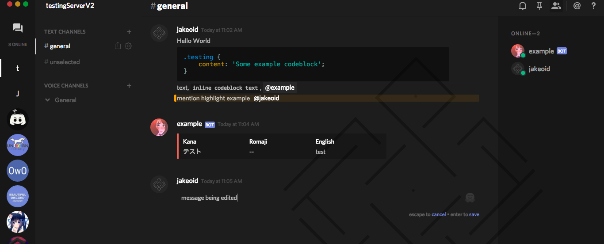

# Jakeoids' Discord Adapta

The following is a BeautifulDiscord theme based on the [Adapta Nokto](https://github.com/adapta-project/adapta-gtk-theme) GTK theme, originally created by the user TheBITLINK#3141 on Discord. However I wasnt happy with the colors being used (blue isnt really my style). So I chose to remix it into the much darker colors that can be seen in the following screenshot.



Packaged you will find `discord-adapta-jakeoid.css`, my remix of the CSS, and the original CSS, `discord-adapta-original.css`. Alongside this the CSS is formatted the same as the original, I had access to a much earlier version and sorted it myself before TheBITLINK did!

## Installation

There are two easy ways to install the client, for this example im going to tell you how to install it using BeautifulDiscord.

1. Download the [BeautifulDiscord](https://github.com/leovoel/BeautifulDiscord) client, instructions for installing can be found there.

2. Clone my code that I have here,
```git clone https://github.com/jakeoid/Discord-Adapta.git```

3. Re-run the BeautifulDiscord command.
```beautifuldiscord --css ./Discord-Adapta/discord-adapta-jakeoid.css``` 

Or if you already have other edits that you want to install it over the top of use..

```@import "https://cdn.rawgit.com/jakeoid/Discord-Adapta/master/discord-adapta-jakeoid.css"```

## Disclaimer

 - Yes, I know this is hacky
 - Yes, I know this is CSS abuse, and I should be in the internet jail right now
 - Yes, I know this isn't even properly formated
 - Yes, I know there's no point on doing this

So I am not responsible for any harm caused by this.
